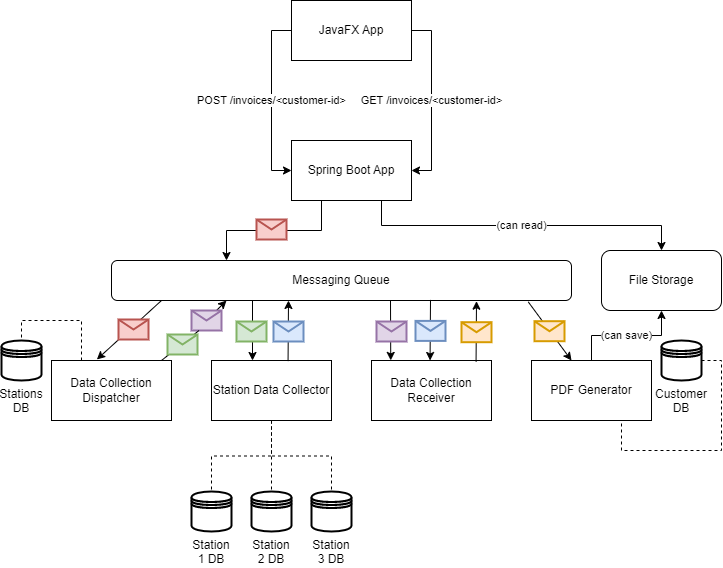

# Fuel Station Data Collector



## Requirements
- [Docker](https://docs.docker.com/get-docker/)

## Start

In FuelStationDataCollector, open up the terminal and execute:

```shell
docker-compose up
```

- Start all Java applications seperately
- Start JavaFX application to start the invoice PDF generation

In the UI application:
- Enter a customerID (e.g. 1-3 are valid)
- A download button appears: download the invoice.pdf for the selected customer
